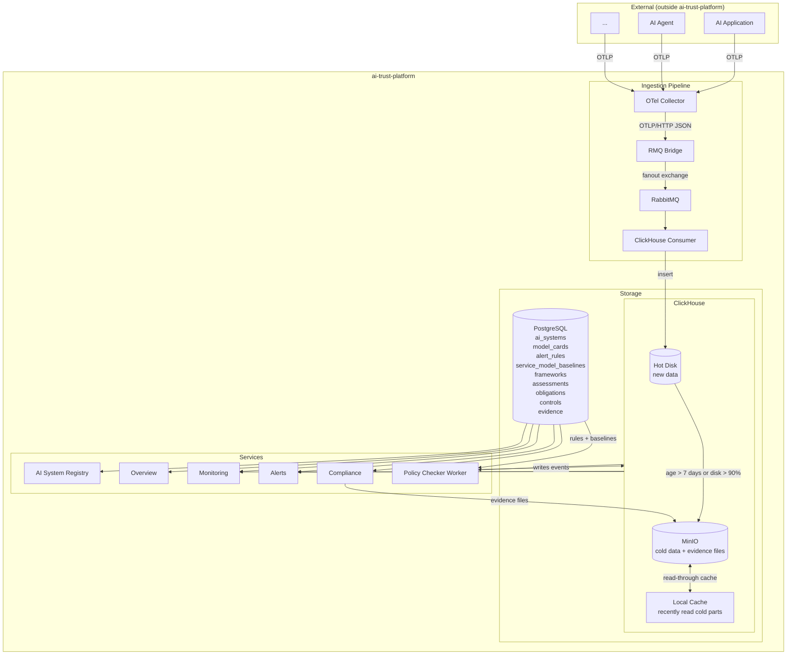
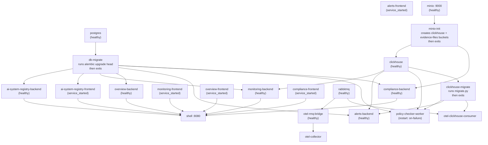

# Architecture

## Repository Layout

```
ai-trust-platform/
├── libs/
│   ├── persistence/              ← shared Python package (models, migrations, DB session)
│   │   ├── Dockerfile            ← one-shot migration container
│   │   ├── pyproject.toml        ← pip installable as ai-trust-persistence
│   │   ├── alembic.ini           ← migration config, reads DATABASE_URL from env
│   │   └── ai_trust_persistence/
│   │       ├── database.py       ← engine (pool_size=5), SessionLocal, Base
│   │       ├── models/           ← all SQLAlchemy ORM models (shared across all backends)
│   │       └── migrations/       ← single Alembic setup for all tables
│   ├── clickhouse/               ← shared Python package (ClickHouse connection + schema)
│   │   ├── Dockerfile            ← one-shot migration container
│   │   ├── pyproject.toml        ← pip installable as ai-trust-clickhouse
│   │   ├── migrate.py            ← idempotent migration runner
│   │   ├── migrations/           ← versioned SQL files tracked in otel.schema_migrations
│   │   └── ai_trust_clickhouse/
│   │       ├── database.py       ← get_client() factory
│   │       └── tables.py         ← GEN_AI_SPANS table name + COLUMNS list
│   └── logging/                  ← shared structured JSON logging package
├── shell/                        ← Luigi host (nginx + luigi-config.js); custom sidebar hamburger
├── ai-system-registry/           ← EU AI Act registry component
│   ├── frontend/                 ← React 18 + Vite SPA (nginx, port 3001)
│   └── backend/                  ← FastAPI + SQLAlchemy async (port 8001)
├── overview/                     ← Compliance overview MFE
│   ├── frontend/                 ← static HTML + Chart.js (nginx, port 3003)
│   └── backend/                  ← FastAPI (port 8004), reads Postgres only
├── monitoring/                   ← Live signals MFE
│   ├── frontend/                 ← static HTML + Chart.js (nginx, port 3002)
│   └── backend/                  ← FastAPI (port 8003), reads Postgres + ClickHouse
├── alerts/                       ← Alerts MFE
│   ├── frontend/                 ← React 18 + TypeScript + Vite SPA (nginx, port 3004)
│   └── backend/                  ← FastAPI (port 8005), reads Postgres (rules) + ClickHouse (events)
├── compliance/                   ← Governance chain MFE (assessments, obligations, controls, evidence)
│   ├── frontend/                 ← React 18 + TypeScript + Vite SPA (nginx, port 3006)
│   └── backend/                  ← FastAPI (port 8007), reads/writes Postgres + MinIO (evidence files)
├── policy-checker-worker/                 ← Background job, evaluates alert rules every N seconds
│   └── main.py                   ← reads Postgres rules, writes ClickHouse events
├── otel-pipeline/                ← GenAI observability pipeline
│   ├── collector/                ← OTel Collector config
│   │   └── otel-collector-config.yaml
│   ├── clickhouse-config/        ← ClickHouse server config overrides (mounted read-only)
│   │   └── config.d/
│   │       ├── storage.xml       ← S3 disk (MinIO) + tiered storage policy definition
│   │       └── listen.xml        ← binds ClickHouse HTTP to 0.0.0.0 (required for Docker networking)
│   └── rmq-bridge/               ← FastAPI OTLP→RabbitMQ bridge (port 8002)
│       └── app/main.py
├── consumers/                    ← RabbitMQ consumers (one sub-dir per sink)
│   └── clickhouse-consumer/      ← writes GenAI spans to ClickHouse
│       └── main.py
└── docker-compose.yml            ← orchestrates all services
```

## GenAI Observability Data Flow



> **Note:** `encoding: json` and `compression: none` are required in the OTel Collector config — the collector defaults to protobuf binary which the bridge cannot parse.

### ClickHouse Storage Tiers

ClickHouse uses a **tiered MergeTree** storage policy with three layers:

| Tier | Location | What lives here |
|---|---|---|
| Hot | Local disk (`clickhouse_data` volume) | All newly ingested data |
| Cold | MinIO S3 (`minio_data` volume) | Data older than 7 days, or when hot disk > 90% full |
| Cache | Local disk (`filesystem_cache/minio/`) | Recently read cold parts, up to 10 GB |

**Read path:** ClickHouse checks hot disk first, then local cache, then fetches from MinIO (and populates the cache). This is fully transparent — all queries use normal SQL regardless of which tier the data is on.

**Write path:** All inserts always go to hot disk. The TTL rule moves parts to MinIO in the background. The cache is never written to directly — it is populated lazily on first read of a cold part.

**Cache invalidation:** Handled automatically by ClickHouse. When a mutation (`ALTER TABLE ... UPDATE/DELETE`) rewrites a part, the cached version is invalidated and the new part is fetched from MinIO on next read. In practice this is rare — `gen_ai_spans` is write-once (spans are never mutated), and `alert_events` mutations only occur when a user handles an alert.

## Docker Startup Order



`db-migrate` is a one-shot container built from `libs/persistence/Dockerfile`. It owns all Postgres migrations — backends never run migrations, they just start the API server.

`clickhouse-migrate` is a one-shot container built from `libs/clickhouse/Dockerfile`. It owns all ClickHouse schema migrations — consumers never run migrations.

`minio-init` is a one-shot container that creates the `clickhouse` bucket in MinIO on first startup. ClickHouse depends on it completing before it starts, ensuring the bucket exists before any data part moves to cold storage.

**If db-migrate fails:** check logs with `docker compose logs db-migrate`. Common causes: postgres not ready (retry `docker compose up db-migrate`), or a bad migration file. Fix the migration, then re-run with `docker compose up --build db-migrate`. The backend will not start until db-migrate exits successfully.

**If clickhouse-migrate fails:** check logs with `docker compose logs clickhouse-migrate`. Common causes: clickhouse not ready (retry `docker compose up clickhouse-migrate`), or a bad SQL file. Fix the migration, then re-run with `docker compose up --build clickhouse-migrate`. The consumer will not start until clickhouse-migrate exits successfully.

**If minio-init fails:** check logs with `docker compose logs minio-init`. Most likely cause: MinIO not ready yet. Retry with `docker compose up minio-init`. ClickHouse will not start until minio-init exits successfully.
