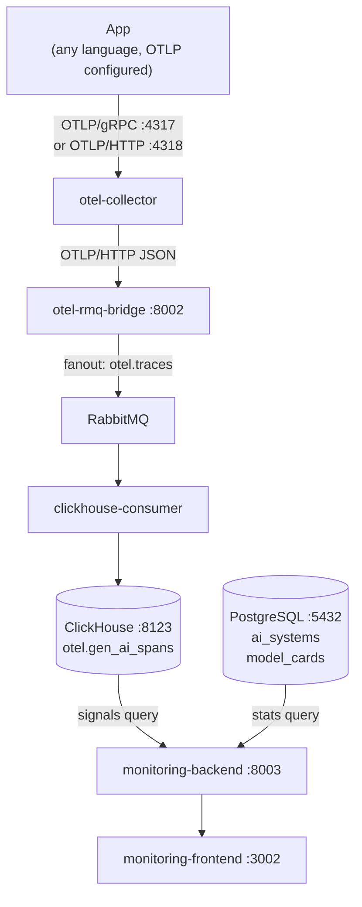
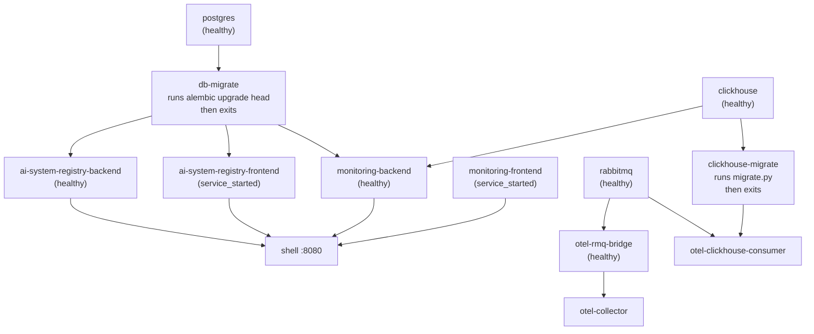

# Architecture

## Repository Layout

```
ai-trust-platform/
├── libs/
│   ├── persistence/              ← shared Python package (models, migrations, DB session)
│   │   ├── Dockerfile            ← one-shot migration container
│   │   ├── pyproject.toml        ← pip installable as ai-trust-persistence
│   │   ├── alembic.ini           ← migration config, reads DATABASE_URL from env
│   │   └── ai_trust_persistence/
│   │       ├── database.py       ← engine (pool_size=5), SessionLocal, Base
│   │       ├── models/           ← all SQLAlchemy ORM models (shared across all backends)
│   │       └── migrations/       ← single Alembic setup for all tables
│   ├── clickhouse/               ← shared Python package (ClickHouse connection + schema)
│   │   ├── Dockerfile            ← one-shot migration container
│   │   ├── pyproject.toml        ← pip installable as ai-trust-clickhouse
│   │   ├── migrate.py            ← idempotent migration runner
│   │   ├── migrations/           ← versioned SQL files tracked in otel.schema_migrations
│   │   └── ai_trust_clickhouse/
│   │       ├── database.py       ← get_client() factory
│   │       └── tables.py         ← GEN_AI_SPANS table name + COLUMNS list
│   └── logging/                  ← shared structured JSON logging package
├── shell/                        ← Luigi host (nginx + luigi-config.js)
├── ai-system-registry/           ← EU AI Act registry component
│   ├── frontend/                 ← static HTML + UI5 Web Components (nginx, port 3001)
│   └── backend/                  ← FastAPI + SQLAlchemy async (port 8001)
├── monitoring/                   ← Monitoring MFE component
│   ├── frontend/                 ← static HTML + Chart.js + SortableJS (nginx, port 3002)
│   └── backend/                  ← FastAPI (port 8003), reads Postgres + ClickHouse
├── otel-pipeline/                ← GenAI observability pipeline
│   ├── collector/                ← OTel Collector config
│   │   └── otel-collector-config.yaml
│   └── rmq-bridge/               ← FastAPI OTLP→RabbitMQ bridge (port 8002)
│       └── app/main.py
├── consumers/                    ← RabbitMQ consumers (one sub-dir per sink)
│   └── clickhouse-consumer/      ← writes GenAI spans to ClickHouse
│       └── main.py
└── docker-compose.yml            ← orchestrates all services
```

## GenAI Observability Data Flow



> **Note:** `encoding: json` and `compression: none` are required in the OTel Collector config — the collector defaults to protobuf binary which the bridge cannot parse.

## Docker Startup Order



`db-migrate` is a one-shot container built from `libs/persistence/Dockerfile`. It owns all Postgres migrations — backends never run migrations, they just start the API server.

`clickhouse-migrate` is a one-shot container built from `libs/clickhouse/Dockerfile`. It owns all ClickHouse schema migrations — consumers never run migrations.

**If db-migrate fails:** check logs with `docker compose logs db-migrate`. Common causes: postgres not ready (retry `docker compose up db-migrate`), or a bad migration file. Fix the migration, then re-run with `docker compose up --build db-migrate`. The backend will not start until db-migrate exits successfully.

**If clickhouse-migrate fails:** check logs with `docker compose logs clickhouse-migrate`. Common causes: clickhouse not ready (retry `docker compose up clickhouse-migrate`), or a bad SQL file. Fix the migration, then re-run with `docker compose up --build clickhouse-migrate`. The consumer will not start until clickhouse-migrate exits successfully.
