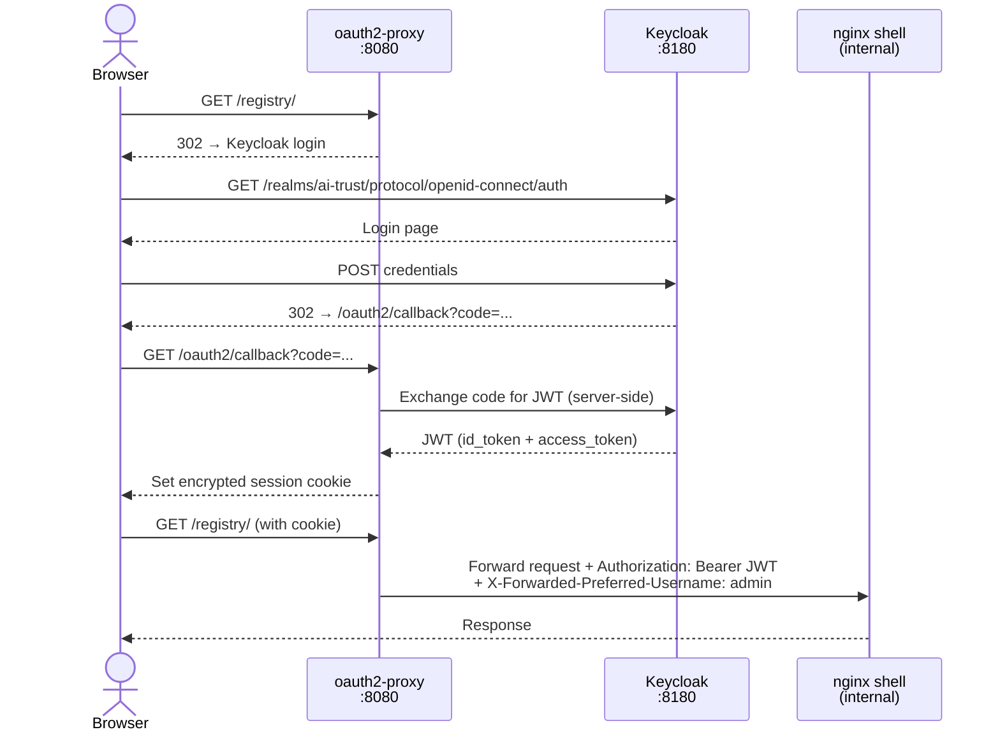
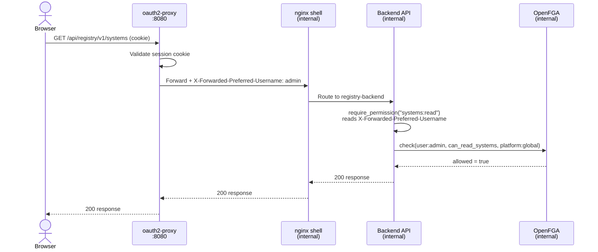
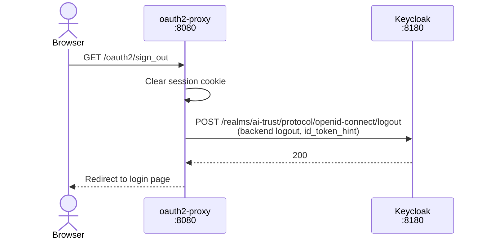

# Authentication & Authorization Flow

## Separation of concerns

| System | Responsibility |
|---|---|
| **Keycloak** | Authentication — who you are (identity, login, JWT issuance) |
| **oauth2-proxy** | Gateway — enforces login, extracts username, forwards headers |
| **nginx (shell)** | Reverse proxy — routes requests to the right backend |
| **OpenFGA** | Authorization — what you can do (roles, permissions) |

---

## Login flow (first request)

---

## Authenticated API request with permission check

---

## Sign out flow

