# CI/CD Pipeline

## Deploy flow

```mermaid
flowchart LR
    developer(["Developer<br/>git push /<br/>workflow_dispatch"])

    subgraph github["🐙 GitHub"]
        direction TB

        subgraph ghcr["📦 GHCR — ghcr.io/AI-Trust-Services"]
            direction TB
            image_artifacts["Image artifacts<br/>name:cluster-sha"]
            chart_artifact["Chart artifact<br/>charts/ai-trust-<br/>platform:0.0.0-cluster-sha"]
            component_artifact["OCM component descriptor<br/>0.0.0-cluster-sha"]
        end

        subgraph actions["⚙️ GitHub Actions — build-push-deploy.yml"]
            direction LR
            build_images["Build Docker images<br/>~22 services"]
            build_chart["Build Helm chart<br/>helm package"]
            build_component["Build OCM component<br/>0.0.0-cluster-sha<br/>refs chart + images"]
            deploy["Deploy step<br/>kubectl apply OCM CRs"]
            cr_apply_succeeded(["CR apply succeeded"])
            cr_apply_failed(["CR apply failed"])
            build_images --> build_chart --> build_component --> deploy
            deploy -->|success| cr_apply_succeeded
            deploy -->|failure| cr_apply_failed
        end

        build_images -. push .-> image_artifacts
        build_chart -. push .-> chart_artifact
        build_component -. push .-> component_artifact
    end

    subgraph cluster["🟪 Gardener Shoot Cluster"]
        direction LR

        subgraph ocm["OCM — resolves pinned component"]
            direction LR
            component_version["ComponentVersion<br/>semver: 0.0.0-cluster-sha"]
            resource["Resource<br/>exposes chart artifact"]
            component_version --> resource
        end

        subgraph flux["Flux — reconciles desired state"]
            direction LR
            flux_deployer["FluxDeployer<br/>creates HelmRelease"]
            helm_release["HelmRelease<br/>valuesFrom: ai-trust-flux-values"]
            flux_deployer --> helm_release
        end

        subgraph helm["Helm — renders + applies chart"]
            direction TB
            workloads["helm upgrade --install ai-<br/>trust<br/><br/>Pods: registry, compliance,<br/>monitoring,<br/>alerts, dta, overview,<br/>users, shell, …"]
            rollout_succeeded(["Rollout succeeded"])
            rollout_failed(["Rollout failed"])
            workloads -->|success| rollout_succeeded
            workloads -->|failure| rollout_failed
        end

        resource --> flux_deployer
        helm_release -->|helm-controller| workloads
    end

    developer --> build_images
    deploy -->|"new component version<br/>triggers upgrade"| component_version
    component_artifact -. pulled by .-> component_version
    image_artifacts -. pulled by .-> workloads
    chart_artifact -. pulled by .-> workloads

    classDef node fill:#f0edff,stroke:#8f8f99,stroke-width:1px,color:#202124
    classDef success fill:#e8f5e9,stroke:#79a77d,stroke-width:1px,color:#16351a
    classDef failure fill:#fdecec,stroke:#bd7777,stroke-width:1px,color:#4d1717
    class developer,build_images,build_chart,build_component,deploy,image_artifacts,chart_artifact,component_artifact,component_version,resource,flux_deployer,helm_release,workloads node
    class cr_apply_succeeded,rollout_succeeded success
    class cr_apply_failed,rollout_failed failure
    style github fill:#fffde7,stroke:#c9c5ae,stroke-width:1px,color:#202124
    style cluster fill:#fffde7,stroke:#c9c5ae,stroke-width:1px,color:#202124
    style actions fill:#fffef2,stroke:#d8d3b8,stroke-width:1px,color:#202124
    style ghcr fill:#fffef2,stroke:#d8d3b8,stroke-width:1px,color:#202124
    style ocm fill:#fffef2,stroke:#d8d3b8,stroke-width:1px,color:#202124
    style flux fill:#fffef2,stroke:#d8d3b8,stroke-width:1px,color:#202124
    style helm fill:#fffef2,stroke:#d8d3b8,stroke-width:1px,color:#202124
    linkStyle default stroke:#777982,stroke-width:1px
```



**Flow:** A push or manual dispatch runs **GitHub Actions**, which builds the Docker images, the Helm chart, and the OCM component — all pushed to **GHCR**. The deploy step applies the OCM CRs to the **Gardener cluster**, where a new component version triggers the chain **OCM → Flux → Helm**: OCM resolves the pinned component, Flux creates/reconciles the `HelmRelease`, and Helm runs `helm upgrade` to roll the pods. The diagram reports success or failure for both applying the OCM CRs and completing the Helm rollout.

---

## Trigger rules

| Event | Images built | OCM published | Deploys to |
|---|---|---|---|
| Push to `main` | ✓ `ai-trust-main-<sha>` + `latest` | ✓ `0.0.0-ai-trust-main-<sha>` + `0.0.0-latest` | `ai-trust-main` (automatic) |
| `workflow_dispatch` → `sr-test` | ✓ `sr-test-<sha>` | ✓ `0.0.0-sr-test-<sha>` | `sr-test` |
| `workflow_dispatch` → `none` | ✓ `<sha>` | ✗ | nowhere |
| Push to feature branch | ✓ `<sha>` | ✗ | nowhere |

---

## Two secrets, two namespaces

Flux resolves `valuesFrom` secrets relative to the HelmRelease's own namespace (`ocm-system`). Flux v2 has no cross-namespace `valuesFrom` support, so two secrets are maintained:

| Secret | Namespace | Contents | Used by |
|---|---|---|---|
| `ai-trust-env` | `ai-trust` | Full credential set from `.env` + computed URLs | Helm chart pods via `envFrom` |
| `ai-trust-flux-values` | `ocm-system` | `APP_PUBLIC_URL`, `KEYCLOAK_PUBLIC_URL`, `INGRESS_*`, `IMAGE_TAG` | FluxDeployer `valuesFrom` → HelmRelease |

---

## Manual deploy commands

```bash
# Deploy main to ai-trust-main (same as push to main)
gh workflow run build-push-deploy.yml --repo AI-Trust-Services/ai-trust-platform --ref main

# Deploy a feature branch to ai-trust-main
gh workflow run build-push-deploy.yml --repo AI-Trust-Services/ai-trust-platform \
  --ref <branch> -f branch=<branch> -f gardener_cluster=ai-trust-main

# Deploy a feature branch to sr-test
gh workflow run build-push-deploy.yml --repo AI-Trust-Services/ai-trust-platform \
  --ref <branch> -f branch=<branch> -f gardener_cluster=sr-test

# Build only, skip deploy
gh workflow run build-push-deploy.yml --repo AI-Trust-Services/ai-trust-platform \
  --ref <branch> -f gardener_cluster=none
```

---

## Manual version changes

`ComponentVersion.spec.version.semver` is set to an exact version string at apply time — the OCM controller never auto-upgrades. To change the deployed version manually:

```bash
# Pin to a different OCM component version
kubectl patch componentversion ai-trust-platform -n ocm-system \
  --type=merge \
  -p '{"spec":{"version":{"semver":"0.0.0-sr-test-abc123def456"}}}'

# Update just the image tag (Flux picks it up within 1m)
kubectl patch secret ai-trust-flux-values -n ocm-system \
  --type=merge \
  -p '{"stringData":{"IMAGE_TAG":"sr-test-abc123def456"}}'
```

---

## Checking deploy status

```bash
# Which OCM component version is reconciled
kubectl get componentversion ai-trust-platform -n ocm-system \
  -o jsonpath='{.spec.version.semver}{"  reconciled="}{.status.reconciledVersion}{"\n"}'

# HelmRelease status
kubectl get helmrelease ai-trust -n ocm-system -o wide

# Pod image tags
kubectl get pods -n ai-trust \
  -o jsonpath='{range .items[*]}{.metadata.name}{"\t"}{.spec.containers[0].image}{"\n"}{end}'

# OCM controller events
kubectl describe componentversion ai-trust-platform -n ocm-system | tail -20
```

> **Note:** the `Applied version:` column in `kubectl get componentversion` is blank due to a known display bug in ocm-controller v0.33. The correct value is in `.status.reconciledVersion`.
