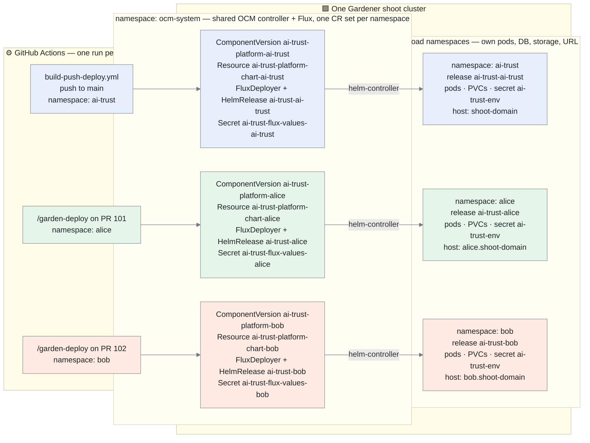

# CI/CD Pipeline

## Deploy flow

Every deploy is **namespace-scoped**: one workflow run builds and deploys exactly one namespace, and
the cluster keeps one independent OCM + Flux CR set per namespace. In the diagram below, **`NS`** is
that namespace — `ai-trust` on `ai-trust-main`, the developer/PR-author name on `ai-trust-test`.

```mermaid
flowchart LR
    subgraph github["🐙 GitHub"]
        direction TB

        subgraph ghcr["📦 GHCR — ghcr.io/AI-Trust-Services"]
            direction TB
            image_artifacts["Image artifacts<br/>name:NS-sha"]
            chart_artifact["Chart artifact<br/>charts/ai-trust-<br/>platform:0.0.0-NS-sha"]
            component_artifact["OCM component descriptor<br/>0.0.0-NS-sha"]
        end

        subgraph actions["⚙️ GitHub Actions — build-push-deploy.yml"]
            direction LR
            resolve_ns["Resolve namespace NS<br/>ai-trust-main → ai-trust<br/>else namespace input<br/>or github.actor"]
            build_images["Build Docker images<br/>~27 services"]
            build_chart["Build Helm chart<br/>helm package"]
            build_component["Build OCM component<br/>0.0.0-NS-sha<br/>refs chart + images"]
            deploy["Deploy step<br/>bootstrap.sh +<br/>kubectl apply OCM CRs<br/>NAMESPACE substituted"]
            resolve_ns --> build_images --> build_chart --> build_component --> deploy
        end

        build_images -. push .-> image_artifacts
        build_chart -. push .-> chart_artifact
        build_component -. push .-> component_artifact
    end

    subgraph cluster["🟪 Gardener Shoot Cluster"]
        direction LR

        subgraph ocm["OCM — resolves pinned component · namespace ocm-system"]
            direction LR
            component_version["ComponentVersion<br/>ai-trust-platform-NS<br/>semver: 0.0.0-NS-sha"]
            resource["Resource<br/>ai-trust-platform-chart-NS"]
            component_version --> resource
        end

        subgraph flux["Flux — reconciles desired state · namespace ocm-system"]
            direction LR
            flux_deployer["FluxDeployer<br/>ai-trust-NS"]
            helm_release["HelmRelease ai-trust-NS<br/>targetNamespace: NS<br/>valuesFrom:<br/>ai-trust-flux-values-NS"]
            flux_deployer --> helm_release
        end

        subgraph helm["Helm — renders + applies chart"]
            direction TB
            workloads["helm upgrade --install<br/>ai-trust-NS in namespace NS<br/><br/>Pods: registry, compliance,<br/>monitoring, alerts, dta,<br/>overview, users, audit,<br/>admin, shell, …"]
        end

        resource --> flux_deployer
        helm_release -->|helm-controller| workloads
    end

    deploy -->|"new component version<br/>triggers upgrade"| component_version
    component_artifact -. pulled by .-> component_version
    image_artifacts -. pulled by .-> workloads
    chart_artifact -. resolved by .-> resource

    classDef node fill:#f0edff,stroke:#8f8f99,stroke-width:1px,color:#202124
    class resolve_ns,build_images,build_chart,build_component,deploy,image_artifacts,chart_artifact,component_artifact,component_version,resource,flux_deployer,helm_release,workloads node
    style github fill:#fffde7,stroke:#c9c5ae,stroke-width:1px,color:#202124
    style cluster fill:#fffde7,stroke:#c9c5ae,stroke-width:1px,color:#202124
    style actions fill:#fffef2,stroke:#d8d3b8,stroke-width:1px,color:#202124
    style ghcr fill:#fffef2,stroke:#d8d3b8,stroke-width:1px,color:#202124
    style ocm fill:#fffef2,stroke:#d8d3b8,stroke-width:1px,color:#202124
    style flux fill:#fffef2,stroke:#d8d3b8,stroke-width:1px,color:#202124
    style helm fill:#fffef2,stroke:#d8d3b8,stroke-width:1px,color:#202124
    linkStyle default stroke:#777982,stroke-width:1px
```



**Flow:** **GitHub Actions** resolves the target namespace first, then builds the Docker images, the
Helm chart, and the OCM component — every artifact tagged `NS-<sha>` and pushed to **GHCR**. The
deploy step (`.github/actions/apply-to-cluster`) runs `bootstrap.sh` (namespace, secrets, ConfigMaps,
RBAC) and applies the OCM CRs to the **Gardener cluster** with `${NAMESPACE}` and `${OCM_VERSION}`
substituted, where a new component version triggers the chain **OCM → Flux → Helm**: OCM resolves the
pinned component, Flux creates/reconciles the `HelmRelease` `ai-trust-NS` (it lives in `ocm-system`,
with `targetNamespace: NS`), and Helm runs `helm upgrade --install ai-trust-NS -n NS` to roll the
pods. The deploy step then force-reconciles a `Stalled` HelmRelease and polls it every 60 s for up to
15 min, failing fast on `InstallFailed`/`UpgradeFailed`.

**How `NS` is resolved** (`prepare` job in `build-push-deploy.yml`, then `apply-to-cluster`):

| Target | Namespace |
|---|---|
| `ai-trust-main` | always `ai-trust` — the platform's long-running namespace, never derived |
| `/garden-deploy` on a PR | the PR author's GitHub username, lowercased |
| any other cluster | the `namespace` workflow input, else `github.actor` lowercased |
| fallback in `apply-to-cluster` | `K8S_NAMESPACE` from `k8s/env/<cluster>/.env`, else `ai-trust` |

### One cluster, many namespaces

A single shoot cluster runs **one** OCM controller and **one** Flux, both of which manage an
independent block of objects per namespace — so `main`, and any number of developer/PR deployments,
coexist on the same cluster without touching each other.



| Scope | Objects |
|---|---|
| **Per namespace** | ComponentVersion `ai-trust-platform-<ns>`, Resource `ai-trust-platform-chart-<ns>`, FluxDeployer + HelmRelease `ai-trust-<ns>`, Secret `ai-trust-flux-values-<ns>` (all in `ocm-system`) · namespace `<ns>` with all pods, PVCs, Ingress, `ai-trust-env` secret, `ghcr-pull-secret` · TLS cert `<ns>/ai-trust-tls` + DNS name · image/chart/OCM version prefix `<ns>-<sha>` |
| **Shared per cluster** | OCM controller, Flux controllers, Traefik ingress controller and its LB Service (each namespace's hostnames are *merged* into the `dns.gardener.cloud/dnsnames` annotation, not overwritten), the `ocm-system` namespace, `ghcr-credentials` secret |

Hostnames follow the namespace: the `ai-trust` namespace uses the bare shoot domain, every other
namespace gets `<ns>.<shoot-domain>`, `keycloak.<ns>.<shoot-domain>`, `minio.<ns>.<shoot-domain>`
(`k8s/env/<cluster>/.env` templates these with `${NAMESPACE}`). Because image tags and OCM versions
are prefixed per namespace, concurrent deployments can never resolve each other's artifacts.

A namespace must be provisioned once before its first deploy (cert, DNS, namespace-scoped CI RBAC):

```bash
bash k8s/gardener_init/shoot-cluster-init.sh ai-trust-test --namespace=<github-username>
```

Without it the deploy fails — the CI identity holds no rights in an unprovisioned namespace.

---

## Trigger rules

`<sha>` is the 12-character short SHA; `<ns>` the resolved namespace.

| Event | Namespace | Images built | OCM published | Deploys to |
|---|---|---|---|---|
| Push to `main` | `ai-trust` | ✓ `ai-trust-main-<sha>` + `latest` | ✓ `0.0.0-ai-trust-main-<sha>` + `0.0.0-latest` | `ai-trust-main` / `ai-trust` (automatic) |
| `/garden-deploy` on a PR | `<pr-author>` | ✓ `<pr-author>-<sha>` | ✓ `0.0.0-<pr-author>-<sha>` | `ai-trust-test` / `<pr-author>` |
| `workflow_dispatch` → `ai-trust-test` | input, else `github.actor` | ✓ `<ns>-<sha>` | ✓ `0.0.0-<ns>-<sha>` | `ai-trust-test` / `<ns>` |
| `workflow_dispatch` → `sr-test` | input, else `github.actor` | ✓ `<ns>-<sha>` | ✓ `0.0.0-<ns>-<sha>` | `sr-test` / `<ns>` |
| `workflow_dispatch` → `ai-trust-main` | `ai-trust` (forced) | ✓ `ai-trust-main-<sha>` + `latest` | ✓ `0.0.0-ai-trust-main-<sha>` + `0.0.0-latest` | `ai-trust-main` / `ai-trust` |
| `workflow_dispatch` → `none` | — | ✓ `<sha>` | ✗ | nowhere |
| Push to feature branch | — | ✓ `<sha>` | ✗ | nowhere |
| Push tag `v*.*.*` | — | ✓ `v1.2.3` | ✗ | nowhere |

The tag prefix for `ai-trust-main` is the **cluster** name, not its namespace (`ai-trust-main-<sha>`,
not `ai-trust-<sha>`) — otherwise it would collide with an `ai-trust` namespace on another cluster.

---

## PR deployment test — `/garden-deploy`

`.github/workflows/pr-deployment-test.yml` builds a PR branch and deploys it to the PR author's
namespace on `ai-trust-test`, so several PRs can be validated on the cluster concurrently.

1. **dispatch** — reads PR head SHA/branch/author, then authorizes: only the PR author or an org
   member may trigger it; anyone else gets a rejection comment and the run fails.
2. **post-start** — posts a "🚀 Test deployment started" PR comment and a `pending` `deploy-test`
   commit status.
3. **deploy** — `workflow_call` into `build-push-deploy.yml` with `gardener_cluster: ai-trust-test`
   and `namespace: <pr-author lowercased>` — a full build + OCM publish + namespaced deploy.
4. **post-result** — success/failure PR comment plus the final `deploy-test` commit status.

---

## Two secrets, two namespaces

Flux resolves `valuesFrom` secrets relative to the HelmRelease's own namespace (`ocm-system`). Flux v2
has no cross-namespace `valuesFrom` support, so two secrets are maintained **per namespace**:

| Secret | Namespace | Contents | Used by |
|---|---|---|---|
| `ai-trust-env` | `<ns>` | Full credential set from `.env` + computed URLs | Helm chart pods via `envFrom` |
| `ai-trust-flux-values-<ns>` | `ocm-system` | `APP_PUBLIC_URL`, `KEYCLOAK_PUBLIC_URL`, `INGRESS_*`, `IMAGE_TAG`, `OLLAMA_ENABLED` | FluxDeployer `valuesFrom` → HelmRelease |

Only the `ocm-system` copy carries the `-<ns>` suffix: all HelmReleases share that one namespace,
while each `ai-trust-env` is already isolated by its own namespace. Both are (re)created by
`k8s/scripts/bootstrap.sh` from the same `.env` on every deploy.

---

## Manual deploy commands

```bash
# Deploy main to ai-trust-main / namespace ai-trust (same as push to main)
gh workflow run build-push-deploy.yml --repo AI-Trust-Services/ai-trust-platform --ref main

# Deploy a feature branch to your own namespace on ai-trust-test
gh workflow run build-push-deploy.yml --repo AI-Trust-Services/ai-trust-platform \
  --ref <branch> -f gardener_cluster=ai-trust-test -f namespace=<github-username>

# Same, letting the namespace default to the triggering user (github.actor, lowercased)
gh workflow run build-push-deploy.yml --repo AI-Trust-Services/ai-trust-platform \
  --ref <branch> -f gardener_cluster=ai-trust-test

# Deploy a feature branch to ai-trust-main (namespace is always ai-trust there)
gh workflow run build-push-deploy.yml --repo AI-Trust-Services/ai-trust-platform \
  --ref <branch> -f gardener_cluster=ai-trust-main

# Build only, skip deploy
gh workflow run build-push-deploy.yml --repo AI-Trust-Services/ai-trust-platform \
  --ref <branch> -f gardener_cluster=none
```

---

## Manual version changes

`ComponentVersion.spec.version.semver` is set to an exact version string at apply time — the OCM
controller never auto-upgrades. Every CR is namespace-suffixed, so patch the one belonging to the
namespace you want to move:

```bash
# Pin to a different OCM component version
kubectl patch componentversion ai-trust-platform-<ns> -n ocm-system \
  --type=merge \
  -p '{"spec":{"version":{"semver":"0.0.0-<ns>-abc123def456"}}}'

# Update just the image tag (Flux picks it up within 1m)
kubectl patch secret ai-trust-flux-values-<ns> -n ocm-system \
  --type=merge \
  -p '{"stringData":{"IMAGE_TAG":"<ns>-abc123def456"}}'
```

---

## Checking deploy status

`<ns>` is `ai-trust` on `ai-trust-main`, the developer/PR-author name on `ai-trust-test`.

```bash
# Every namespaced deployment on the cluster at a glance
kubectl get componentversion,resource,fluxdeployer -n ocm-system
kubectl get helmrelease -n ocm-system -o wide

# Which OCM component version is reconciled for one namespace
kubectl get componentversion ai-trust-platform-<ns> -n ocm-system \
  -o jsonpath='{.spec.version.semver}{"  reconciled="}{.status.reconciledVersion}{"\n"}'

# HelmRelease status
kubectl get helmrelease ai-trust-<ns> -n ocm-system -o wide

# Pod image tags
kubectl get pods -n <ns> \
  -o jsonpath='{range .items[*]}{.metadata.name}{"\t"}{.spec.containers[0].image}{"\n"}{end}'

# OCM controller events
kubectl describe componentversion ai-trust-platform-<ns> -n ocm-system | tail -20
```

> **Note:** the `Applied version:` column in `kubectl get componentversion` is blank due to a known display bug in ocm-controller v0.33. The correct value is in `.status.reconciledVersion`.
