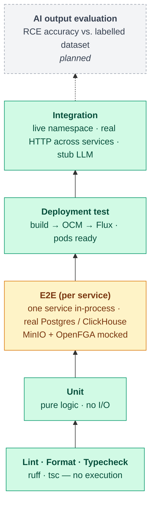
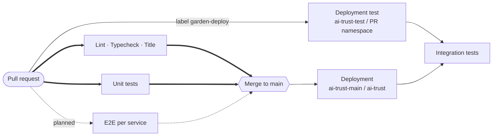
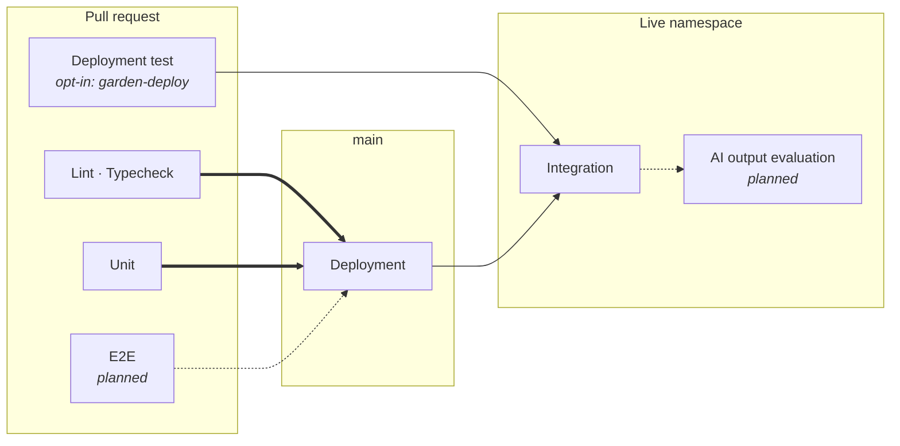
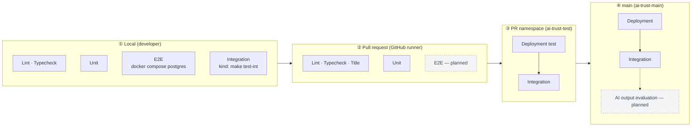
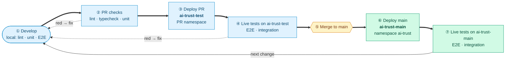
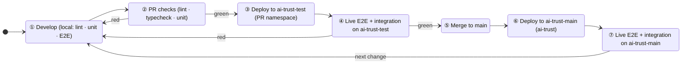

# Test strategy — visualization candidates (TEMPORARY)

> Pick one option for [tests.md](tests.md). The chosen diagram(s) move into `tests.md` and this
> file is deleted before merge.
>
> Line styles in all flow diagrams: **thick `==>`** = blocks / is a gate · **solid `-->`** =
> runs, informational · **dashed `-.->`** = planned (label says so).

---

## Option A — Pyramid + CI flow (two diagrams)

**A1 — What each level tests (scope grows upwards)**

**A2 — When each level runs**

*Pros:* answers "what" and "when" separately, both stay readable. *Cons:* two diagrams to maintain.

---

## Option B — CI flow + levels table

| Level | Boundary | Blocks merge |
|---|---|---|
| Lint / typecheck | no execution | reported (required: proposed) |
| Unit | pure logic | reported (required: proposed) |
| E2E | 1 service + DB | planned |
| Deployment test | rollout healthy | PR check (opt-in) |
| Integration | live, cross-service | no |
| AI output evaluation | AI accuracy | 🔶 TBD |

*Pros:* one diagram; detail lives in a table that's easy to edit. *Cons:* the levels' scope isn't visual.

---

## Option C — Swimlane by stage

*Pros:* shows where a developer can reproduce each level locally. *Cons:* blocking vs. informational is less visible.

---

## Option D — MVP flow × test levels matrix

Coverage of the four MVP steps per level (✅ exists · ⬜ missing · ⚠️ partial · — not applicable).

| MVP step | Unit | E2E | Integration | AI output evaluation |
|---|---|---|---|---|
| 1. Registration | ✅ | ✅ | ⚠️ register + RBAC only | — |
| 2. Self-assessment | ✅ | ✅ | ⬜ | ⬜ (AI pre-fill) |
| 3. Risk classification | ✅ classifier waterfall | ✅ | ⚠️ obligation set only | ⬜ |
| 4. Classification confirmation | ✅ | ✅ | ⬜ (audit gap) | — |

*Pros:* ties test levels directly to the business flow, which is the PM's view. *Cons:* the unit/E2E
cells need verifying per scenario and go stale quickly; best combined with A2 or B.

---

## Option E — Development loop

One change goes round the loop: develop → PR checks → deploy to `ai-trust-test` → live tests →
merge → deploy to `ai-trust-main` → live tests → next change. A red step sends the change back to
**Develop**.

**E1 — Loop as a flowchart**

**E2 — Loop as a cycle**

*Pros:* shows testing as a continuous development cycle, and makes the two environments (PR test
cluster vs. central system) visible. *Cons:* Mermaid has no true circular layout; the loop is shown
by the return edge, not by a drawn circle.
