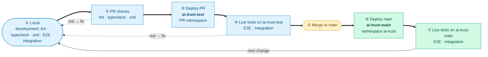

# Test Strategy — AI Trust Platform MVP

> **Status: DRAFT — for review with PM and engineering lead**.
> Sections marked **🔶 Open** need a decision before this document is approved.

## Executive summary

- **Test levels:** lint/typecheck, unit, deployment test, E2E (per service), integration and E2E system
  (see [Test levels](#test-levels)). AI output evaluation is planned on top (see [AI output evaluation](#ai-output-evaluation))
- **MVP acceptance is defined by business flow, not code coverage.** Every MVP step
  (Registration → Self-assessment → Risk classification → Classification confirmation) has a set of
  mandatory **E2E system** scenarios (see [MVP E2E system scenarios](#mvp-e2e-system-scenarios)).
  **Integration** scenarios back them with technical proof that services work together
  (see [MVP integration scenarios](#mvp-integration-scenarios)).
- **Coverage targets:** 🔶 TBD. No coverage targets for now.

## Test levels

| Repo term | Industry term | Boundary |
|---|---|---|
| Lint / typecheck | Static analysis | No execution |
| Unit | Unit | Pure logic, no I/O |
| Deployment test | Smoke / deployment verification | Helm/OCM rollout healthy |
| E2E | End to end micro service | One service in-process + real DB, other services mocked |
| Integration | Cross-service integration | Real HTTP between deployed services: shared data contracts, cascades, RBAC across backends. See [MVP integration scenarios](#mvp-integration-scenarios) |
| E2E System | System / end-to-end (API level) | Business flows driven black-box through the whole deployed platform, incl. the shell proxy; no browser or login. See [MVP E2E system scenarios](#mvp-e2e-system-scenarios) |

### Integration vs E2E system

Both run against the deployed platform over real HTTP. They differ in what they prove.

| | Integration | E2E system |
|---|---|---|
| **Proves** | Technical: services work together | Business: requirements and personas' flows are met |
| **Question** | Do services agree on a contract? | Can a user complete the MVP flow? |
| **Scope** | One interaction between services (shared data, cascade, internal call, permission denial) | A journey of many steps handed over between personas |
| **Entry point** | Service APIs directly | User-facing path, incl. the shell proxy |
| **A failure means** | A technical seam is broken | A business requirement is not met |
| **Role in MVP** | Supporting technical proof | Acceptance criteria |

Rule of thumb: a scenario that exists because of a **technical contract** is Integration; one that
exists because of a **business requirement or persona flow** is E2E system.

---

## Development loop

One change goes round the loop: develop → PR checks → deploy to `ai-trust-test` → live tests →
merge → deploy to `ai-trust-main` → live tests → next change. A red step sends the change back to
**Develop**.

### Quality gates

| Gate | Criteria |
|---|---|
| **PR mergeable** | Lint, format, typecheck, unit, E2E, integration green checks |
| **`main` deployment** | Deployment workflow green · E2E & integration green otherwise investigate any red `e2e-tests`/ `integration-tests` status before the next merge |

---

## MVP integration scenarios

**Technical proof that services work together**: contracts, shared data, cascades and permission
enforcement across backends. A failure points to a broken technical seam. Business-flow scenarios live
in [MVP E2E system scenarios](#mvp-e2e-system-scenarios). How the two differ: see
[Integration vs E2E system](#integration-vs-e2e-system).

Legend: ✅ test covered · ⬜ test missing, functionality exists

### 0. Health checks

| Scenario | State |
|---|---|
| Health of all 7 backends | ✅ `test_01_health.py` |
| Admin stats call the users backend | ✅ `test_03_rbac.py` |

### 1. Registration

| Scenario | State |
|---|---|
| Application Owner registers a system → visible in registry and compliance | ✅ `test_02_registry_compliance.py` |
| Role without write permission (e.g. Auditor) cannot register (403) | ✅ `test_03_rbac.py` |
| AI Engineer can register a system | ⬜ |

### 3. Risk classification

| Scenario | State |
|---|---|
| Platform administrator cannot read assessments (403) | ✅ `test_03_rbac.py` |

### 5. Requirements — outside MVP scope (regression only)

| Scenario | State |
|---|---|
| Assessment creation generates requirements for each obligation | ✅ `test_02_registry_compliance.py` |

### 6. Evidence upload — outside MVP scope (regression only)

| Scenario | State |
|---|---|
| Evidence uploaded and linked to a requirement | ✅ `test_02_registry_compliance.py` |

### 7. Approval — outside MVP scope (regression only)

| Scenario | State |
|---|---|
| Evidence approval / rejection cascades compliance score to registry | ✅ `test_02_registry_compliance.py` |
| AI Engineer cannot approve evidence (403) | ✅ `test_03_rbac.py` |

Monitoring follows Approval in the lifecycle and is outside MVP scope; no integration scenarios.

---

## MVP E2E system scenarios

**Proof of business requirements**: the MVP flow works for each persona as the product intends. These
scenarios are the MVP acceptance criteria. A failure points to an unmet requirement. Technical
contract checks live in [MVP integration scenarios](#mvp-integration-scenarios).

Legend: ✅ test covered · ⬜ test missing, functionality exists

Personas: Application Owner, AI Engineer, Compliance Officer.

### 0. Platform reachable

Frontend checks are kept basic for MVP: plain HTTP requests, with no browser and no login. They catch
a missing bundle or a broken nginx route.

| Scenario | State |
|---|---|
| Shell entry page is served (HTTP 200, HTML) | ⬜ |
| MVP frontends (Registry, Compliance) are served through the shell proxy (HTTP 200, HTML) | ⬜ |
| MVP backend APIs (Registry, Compliance) are reachable through the shell proxy | ⬜ |

### 1. Registration

| Scenario | State |
|---|---|
| AI-assisted registration: conversational intake and an uploaded document pre-fill the registration fields (the document is parsed, not stored) | ⬜ |

### 2. Self-assessment

| Scenario | State |
|---|---|
| Self-assessment started for a registered system → assessment `questionnaire_pending` (compliance); section assignees, Compliance Officer and intended purpose recorded on the system (registry) | ⬜ |
| Application Owner submits the business section → AI Engineer submits the technical section → system `pending_review` | ⬜ |
| EU AI Act role (provider / deployer / both) set for the system: entered at registration, inferred by the AI at classification | ⬜ |
| Single question delegated to a contributor and answered | ⬜ |

### 3. Risk classification

| Scenario | State |
|---|---|
| Obligation set generated for a system classified before the assessment starts | ✅ `test_02_registry_compliance.py` |
| AI mode (default): free-text technical answers → AI-inferred flags, tier, EU AI Act role and per-criterion rationale with confidence stored | ⬜ |
| Classification completed → obligations and requirements generated for the classified tier and role; assessment `pending_review` | ⬜ |
| Changed flags + reclassify update the tier | ⬜ |

### 4. Classification confirmation

| Scenario | State |
|---|---|
| Assigned Compliance Officer reviews the AI rationale per criterion and the obligation set; other users don't see the rationale | ⬜ |
| Compliance Officer approves → system `approved` (registry) and assessment `approved` (compliance); risk flags locked (422) | ⬜ |
| Compliance Officer corrects tier and/or EU AI Act role on approval → corrected values stored (a tier correction is noted in the basis) | ⬜ |
| Reject → system back to the chosen section and assessment reopened (`questionnaire_pending`); request-info → only the reopened section editable | ⬜ |
| Only the assigned Compliance Officer can confirm: AI Engineer and Application Owner get 403; unanswered required questions get 422 | ⬜ |

---

## AI output evaluation

> Metrics and thresholds are not decided. Will be covered with AI Assisted functionality implementation.

Placeholder scope, to be confirmed:
- **What:** accuracy of the AI-assisted RCE: flags extracted from questionnaire answers and uploaded
  documents, and the resulting tier and EU AI Act role, against a labelled dataset covering all tiers.
- **Inputs:** labelled dataset, evaluation pipeline and test bed (planned).
- **Relation to functional tests:** integration and E2E system tests prove the workflow works with a deterministic
  stub. Evaluation proves the AI output is good enough.
- **To decide:**
  - metrics (per-tier precision/recall?) and MVP thresholds
  - confidence calibration, needed if a confidence threshold routes classifications
  - label mapping: the MVP scope uses combined classes (e.g. high risk + transparency), while the
    classifier returns a single tier and also has GPAI tiers
  - which LLM provider and model is evaluated, and whether evaluation runs in CI or on demand

---

## Coverage targets

🔶 **TBD.** No coverage tooling (`pytest-cov`) is configured. Targets will be defined once baseline
data exists. Until then, MVP acceptance is measured by the business scenarios above.

---

## Open questions

🔶 To decide in the review with PM and engineering lead:

| # | Question | Affects |
|---|---|---|
| 1 | Is frontend tests part of MVP ? |
| 2 | Is test coverage part of MVP ? |

---

## Next steps

| # | Action | State |
|---|---|---|
| 1 | Review and approve this document with PM and engineering lead, including the open questions | 🔶 open |
| 2 | After approval: create follow-up issues | 🔶 open  |

### Proposed follow-up issues (create after approval)

1. **Integration tests:** implement every ⬜ scenario in
   [MVP integration scenarios](#mvp-integration-scenarios) in `tests/integration/` Milestone: DevOps.
2. **E2E system tests for the MVP flow:** implement every ⬜ scenario in
   [MVP E2E system scenarios](#mvp-e2e-system-scenarios). 🔶 Location and CI status name to decide
   (new suite vs. a marker in `tests/integration/`). Milestone: DevOps.
