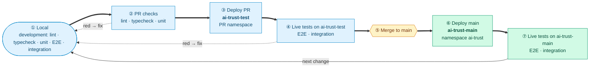

# Test Strategy — AI Trust Platform MVP

> **Status: DRAFT — for review with PM and engineering lead**.
> Sections marked **🔶 Open** need a decision before this document is approved.

---

## Test levels

| Repo term | Industry term | Boundary | MVP |
|---|---|---|---|
| Lint / typecheck | Static analysis | Code validation | ✅ |
| Unit | Unit | Pure logic, no I/O | ✅ |
| E2E per service | End-to-end micro service | One service in-process, other services mocked | ✅ |
| Integration | Cross-service technical integration | Technical contracts between deployed services over real HTTP: shared data, RBAC enforcement, cascades, internal calls. See [Integration scenarios](#integration-scenarios) | ✅ |
| E2E System | System / end-to-end (API level), domain | MVP business requirements: full happy-path persona flows driven black-box through the whole deployed platform; no browser or login. See [E2E system scenarios](#e2e-system-scenarios) | ✅ |
| Deployment test | Deployment verification | Helm/OCM rollout healthy, K8s liveness & readiness probes.| ✅ |
| AI output evaluation | ML evaluation | Accuracy of AI-assisted classification against a labelled dataset. See [AI output evaluation](#ai-output-evaluation) | ✅ |
| Frontend tests | Component / visual regression | React component behaviour and visual states; proposed tool: Playwright (Apache 2.0). See [Frontend tests](#frontend-tests) | TBD |
| Performance / load | Performance | Throughput, latency, and race-condition checks under load | TBD |
| Security | Security | Server-side RBAC, upload constraints, URL expiry, append-only audit | TBD |

**Test Coverage: measure, don't gate.** `pytest-cov` runs in report-only mode with no threshold; it never
fails a build (see [Test Code Coverage](#test-code-coverage)).

---

## Development loop

One change goes round the loop: develop → PR checks → deploy to `ai-trust-test` → live tests →
merge → deploy to `ai-trust-main` → live tests → next change. A red step sends the change back to
**Develop**.

## Integration scenarios

**Cross-service technical integration**: proof that deployed services work together at their technical
seams — shared data integrity, RBAC enforcement across backends, cascade side-effects, internal HTTP
calls, and platform wiring. These run in-cluster (kind or Gardener) over real HTTP. A failure points
to a broken technical contract, not a missing business requirement.

The integration tests talk directly to backend ports (via kubectl port-forward), so they never go through oauth2-proxy or Keycloak

Legend: ✅ test covered · ⬜ test missing, functionality exists

### A. Platform wiring and reachability

| Scenario | State |
|---|---|
| Health of all backends (each `/health` also checks its DB connection) | ✅ `test_01_health.py` |
| Shell entry page is served (HTTP 200, HTML) | ⬜ |
| MVP frontends (Registry, Compliance) are served through the shell proxy (HTTP 200, HTML) | ⬜ |
| MVP backend APIs (Registry, Compliance) are reachable through the shell proxy | ⬜ |

### B. Registry ↔ Compliance

| Scenario | State |
|---|---|
| Registered system is resolvable by compliance (shared FK integrity) | ✅ `test_02_registry_compliance.py` |
| Assessment creation auto-generates obligations and requirements for all tiers | ✅ `test_02_registry_compliance.py` |
| Approved evidence cascades compliance score back to `ai_systems.compliance` | ✅ `test_02_registry_compliance.py` |
| Rejected evidence reverts compliance score | ✅ `test_02_registry_compliance.py` |
| Delete assessment including dependencies (obligations, requirements) and associated risk classification on the system | ⬜ |
| Document upload → link to system → delete attempt blocked → unlink → delete succeeds | ⬜ |
| Audit flush worker — event written to Postgres buffer → flushed to ClickHouse → deleted from Postgres | ⬜ |
| Assessment submitted to CO → `workflow_status` transitions correctly through all states (`draft → pending_assessment → pending_review → approved`) | ⬜ |
| CO request-info → section re-opened → submit-info → reclassification → back to `pending_review` | ⬜ |
| Per-question assignment → contributor answers → approval gate enforced | ⬜ |

### C. RBAC (cross-service)

These scenarios verify that role checks are enforced at the API level across service boundaries, not
just in the frontend.

| Scenario | State |
|---|---|
| Auditor cannot write systems (403) | ✅ `test_03_rbac.py` |
| AI Engineer can write systems | ⬜ |
| AI Business Owner can write systems | ⬜ |
| AI Engineer can start an assessment | ⬜ |
| AI Business Owner can start an assessment | ⬜ |
| Assignee can unassign themselves within an assessment | ⬜ |
| Person who assigned others can unassign those assignees within an assessment | ⬜ |
| Compliance Officer can forward an assessment to a different Compliance Officer | ⬜ |
| Compliance Officer can send an assessment back to the responsible person to provide more information | ⬜ |
| Compliance Officer can confirm and finish an assessment | ⬜ |
| Platform Administrator cannot read assessments (403) | ✅ `test_03_rbac.py` |
| Admin stats endpoint aggregates correctly across backends | ✅ `test_03_rbac.py` |
| AI Engineer cannot approve evidence (403) | ✅ `test_03_rbac.py` |

---

## E2E system scenarios

**Full happy-path business flows**: proof that the MVP flow works end-to-end as the business requires
for each persona. Each scenario is a complete flow driven black-box through the deployed platform.
These are the MVP acceptance criteria. A failure points to an unmet business requirement.

Legend: ✅ test covered · ⬜ test missing, functionality exists

### 1. Registration

| Scenario | State |
|---|---|
| AI Engineer registers a new system end-to-end through the shell proxy | ⬜ |
| AI-assisted registration: conversational intake and an uploaded document pre-fill the registration fields | ⬜ |

### 2. Self-assessment

| Scenario | State |
|---|---|
| Application Owner submits the business section → AI Engineer submits the technical section → system `pending_review` | ⬜ |
| Section owner delegates a question to a sub-assignee → sub-assignee answers → owner reclaims | ⬜ |

### 3. Risk classification

| Scenario | State |
|---|---|
| Full governance chain: register system → fill assessment (AI Engineer + Application Owner) → AI-based preclassification → submit to CO → CO approves → confirmed classification | ⬜ |
| Bounce-back flow: CO requests info → section reopened → owner resubmits → system reclassified → CO approves | ⬜ |

### 4. Classification confirmation

| Scenario | State |
|---|---|
| Compliance Officer approves → system `approved` (registry) and assessment `approved` (compliance); risk flags locked | ⬜ |
| Compliance Officer corrects tier and/or EU AI Act role on approval → corrected values stored | ⬜ |

### 5. Requirements — outside MVP scope (regression only)

| Scenario | State |
|---|---|
| Assessment creation generates requirements for each obligation | ✅ `test_02_registry_compliance.py` |

### 6. Evidence upload — outside MVP scope (regression only)

| Scenario | State |
|---|---|
| Evidence uploaded and linked to a requirement | ✅ `test_02_registry_compliance.py` |

### 7. Approval — outside MVP scope (regression only)

| Scenario | State |
|---|---|
| Evidence approval / rejection cascades compliance score to registry | ✅ `test_02_registry_compliance.py` |

Monitoring follows Approval in the lifecycle and is outside MVP scope; no E2E system scenarios.

---

## Frontend tests

> **Currently zero coverage — identified gap.** 🔶 See open question #1.

**Proposed tool: [Playwright](https://playwright.dev/)** — Apache 2.0 licensed, runs on standard
GitHub-hosted runners without additional infrastructure, and covers both component-level interaction
and visual regression via screenshot comparison. It replaces the need for a separate Storybook +
Chromatic stack.

### Component tests (React Testing Library or Playwright component testing)

| Scenario |
|---|
| Registry table renders correct columns (Title, Owner) |
| Detail view opens on row click and displays all fields |
| Add/Edit form — required field validation prevents submission |
| Document library table — version number and actions rendered correctly |
| Task view — correct actions shown per task type (unassign vs. forward) |
| Login pop-up — renders when tasks open; dismiss and navigate actions work |

### Visual regression (Playwright screenshot)

| Scenario |
|---|
| Key UI states: empty states, error states, and loading states across all tables and forms |

---

## AI output evaluation

> Metrics and thresholds are not decided. Will be covered with AI Assisted functionality implementation.

Placeholder scope, to be confirmed:
- **What:** accuracy of the AI-assisted RCE: flags extracted from questionnaire answers and uploaded
  documents, and the resulting tier and EU AI Act role, against a labelled dataset covering all tiers.
- **Inputs:** labelled dataset, evaluation pipeline and test bed (planned).
- **Relation to functional tests:** integration and E2E system tests prove the workflow works with a deterministic
  stub. Evaluation proves the AI output is good enough.
- **To decide:**
  - metrics (per-tier precision/recall?) and MVP thresholds
  - confidence calibration, needed if a confidence threshold routes classifications
  - label mapping: the MVP scope uses combined classes (e.g. high risk + transparency), while the
    classifier returns a single tier and also has GPAI tiers
  - which LLM provider and model is evaluated, and whether evaluation runs in CI or on demand

---

## Test Code Coverage

**Measure, don't gate.** Coverage is reported, not enforced:

- **Tool:** `pytest-cov` (line coverage; branch coverage optional).
- **Mode:** report-only. **No threshold**, no `--cov-fail-under`, no PR or `main` gate. A low number
  never fails a build.
- **Scope:** the in-process levels: unit and per-service E2E (`tests/unit/`, `tests/e2e/`). The live
  platform levels (integration, E2E system) are black-box over HTTP and are not measured for code
  coverage; they are measured by the business and technical scenarios above.
- **Output:** a terminal summary and an XML/HTML report per backend, available as CI artifacts. No
  external coverage service for now.
- **Purpose:** build a baseline and spot untested areas. Targets and any gate are decided later,
  once baseline data exists. Until then, MVP acceptance is measured by the business scenarios above.

---

## Open questions

🔶 To decide in the review with PM and engineering lead:

| # | Question | Affects |
|---|---|---|
| 1 | Are frontend tests part of MVP? Proposed tool: Playwright (Apache 2.0, GitHub-hosted runners). | Frontend tests section |
| 2 | Test Code Coverage is report-only for MVP (no threshold). When do we introduce a threshold or gate? | Test Code Coverage section |

---

## Next steps

| # | Action | State |
|---|---|---|
| 1 | Review and approve this document with PM and engineering lead, including the open questions | 🔶 open |
| 2 | After approval: create follow-up issues | 🔶 open |
