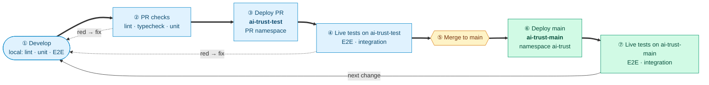

# Test Strategy — AI Trust Platform MVP

> **Status: DRAFT — for review with PM and engineering lead**.
> Sections marked **🔶 Open** need a decision before this document is approved.

## Executive summary

- **Six test levels** run in the repo or on a cluster, from static checks up to live cross-service tests:
  lint/typecheck → unit → E2E (per service) → deployment test → integration. AI output evaluation
  is planned separately (**🔶 open, review with AI Lead**). Each level has a fixed boundary (see
  [Test levels](#test-levels)).
- **MVP acceptance is defined by business flow, not code coverage.** Every MVP step
  (Registration → Self-assessment → Risk classification → Classification confirmation) has a set of
  mandatory **integration** scenarios (see [MVP integration scenarios](#mvp-integration-scenarios)).
  The functionality behind all of them exists. Most of the tests do not exist yet.
- **Coverage targets:** 🔶 TBD. No coverage tests as for now. 

## Test levels

| Repo term | Industry term | Boundary |
|---|---|---|
| Lint / typecheck | Static analysis | No execution |
| Unit | Unit | Pure logic, no I/O |
| Deployment test | Smoke / deployment verification | Helm/OCM rollout healthy |
| E2E | Service / component integration | One service in-process + real DB, other services mocked |
| Integration | System / cross-service E2E | Live namespace, real HTTP between services |

---

## Development loop

One change goes round the loop: develop → PR checks → deploy to `ai-trust-test` → live tests →
merge → deploy to `ai-trust-main` → live tests → next change. A red step sends the change back to
**Develop**.

---

## MVP integration scenarios

Legend: ✅ test exists · ⬜ test missing, functionality exists · ⚠️ functionality partly missing

### 0. Health checks

Frontend checks are kept basic for MVP: plain HTTP requests in the same integration suite, with no
browser and no login. They catch a missing bundle or a broken nginx route. UI behaviour is checked
in PM walkthroughs.

| Scenario | State |
|---|---|
| Health of all 7 backends | ✅ `test_01_health.py` |
| Admin stats call the users backend | ✅ `test_03_rbac.py` |
| Shell entry page is served (HTTP 200, HTML) | ⬜ |
| MVP frontends (Registry, Compliance) are served through the shell proxy (HTTP 200, HTML) | ⬜ |
| MVP backend APIs (Registry, Compliance) are reachable through the shell proxy | ⬜ |

### 1. Registration

| Scenario | State |
|---|---|
| AI Engineer registers a system → visible in registry and compliance | ✅ `test_02_registry_compliance.py` |
| Supporting document uploaded and model card linked | ⬜ |
| Role without `systems:write` cannot register (403) | ✅ `test_03_rbac.py` |

### 2. Self-assessment

| Scenario | State |
|---|---|
| Sections assigned → business submitted → technical submitted → `pending_review` | ⬜ |
| Single question assigned to a contributor and answered | ⬜ |

### 3. Risk classification

| Scenario | State |
|---|---|
| Technical submit stores `tier`, `basis`, `org_role` matching the deterministic classifier for the given flags | ⬜ |
| Assessment creation generates the obligation set for the tier | ✅ `test_02_registry_compliance.py` |
| Changed flags + reclassify update the tier | ⬜ |
| Platform administrator cannot read assessments (403) | ✅ `test_03_rbac.py` |

### 4. Classification confirmation

| Scenario | State |
|---|---|
| Compliance Officer approves → `approved`, risk flags locked (422), decision in audit trail | ⚠️ approve and lock exist; **approve/reject/request-info write no audit events** |
| Reject → section back to `business_pending` / `technical_pending`; request-info → `info_requested`, only the reopened section editable | ⬜ |
| Non-CO cannot approve (403); CO cannot approve with unanswered required questions (422) | ⬜ |

### 5. Requirements — outside MVP scope (regression only)

| Scenario | State |
|---|---|
| Assessment creation generates requirements for each obligation | ✅ `test_02_registry_compliance.py` |

### 6. Evidence upload — outside MVP scope (regression only)

| Scenario | State |
|---|---|
| Evidence uploaded and linked to a requirement | ✅ `test_02_registry_compliance.py` |

### 7. Approval — outside MVP scope (regression only)

| Scenario | State |
|---|---|
| Evidence approval / rejection cascades compliance score to registry | ✅ `test_02_registry_compliance.py` |
| AI Engineer cannot approve evidence (403) | ✅ `test_03_rbac.py` |

Monitoring follows Approval in the lifecycle and is outside MVP scope; no integration scenarios.

---

## AI output evaluation

> **🔶 Open — to review with AI Lead.** Metrics and thresholds are not decided.

Placeholder scope, to be confirmed:
- **What:** accuracy of the AI-assisted RCE: inferred flags, resulting tier and `org_role`, against
  a labelled dataset covering all tiers.
- **Inputs:** labelled dataset, evaluation pipeline and test bed (planned).
- **Relation to functional tests:** integration tests prove the workflow works with a deterministic
  stub. Evaluation proves the AI output is good enough. A release needs both.
- **To decide:** metrics (per-tier precision/recall?), MVP thresholds, which LLM provider and
  model is evaluated, whether evaluation runs in CI or on demand.

---

## Quality gates (proposed)

| Gate | Criteria |
|---|---|
| **PR mergeable** | Lint, format, typecheck, unit green · E2E green once it runs in CI · these configured as required checks on `main` |
| **Deployed to `main`** | Deployment workflow green · integration suite green (investigate any red `integration-tests` status before the next merge) |
| **MVP testable** | All four MVP steps deployed on `ai-trust-main` · every scenario in [MVP integration scenarios](#mvp-integration-scenarios) implemented and green there |

## Coverage targets

🔶 **TBD.** No coverage tooling (`pytest-cov`) is configured. Targets will be defined once baseline
data exists. Until then, MVP acceptance is measured by the business scenarios above.

---

## Next steps

| # | Action | State |
|---|---|---|
| 1 | Review and approve this document with PM and engineering lead | 🔶 pending |
| 2 | Decide AI output evaluation metrics and thresholds with AI Lead | 🔶 pending |
| 3 | After approval: create follow-up issues (below) | not started |
| 4 | Configure required status checks on `main` (lint, typecheck, unit; E2E once it runs in CI) | not started |
| 5 | Define coverage targets once tooling and baseline exist | not started |

### Proposed follow-up issues (create after approval)

1. **Integration tests for the MVP flow:** implement every ⬜/⚠️ scenario in
   [MVP integration scenarios](#mvp-integration-scenarios) in `tests/integration/`, using
   `manual_questionnaire` mode and the stub LLM, including the basic frontend availability checks (0. Health checks).
   Milestone: DevOps.
2. **Record classification workflow transitions in the audit trail:** `ai-system-registry`
   `routers/workflow.py` (submit-technical, approve incl. tier/`org_role` override old → new,
   reject, request-info, submit-info) writes `system_workflow_steps` and logs, but no
   `log_audit_event`. This blocks the audit assertion in step 4 (Classification confirmation). Milestone: Core.
3. **Required status checks on `main`:** make the existing PR checks blocking.

---

## Maintaining this document

Update `docs/tests.md` in the same PR whenever you add or change a test level, a CI test workflow,
a quality gate, or an MVP integration scenario (flip ⬜ → ✅).
