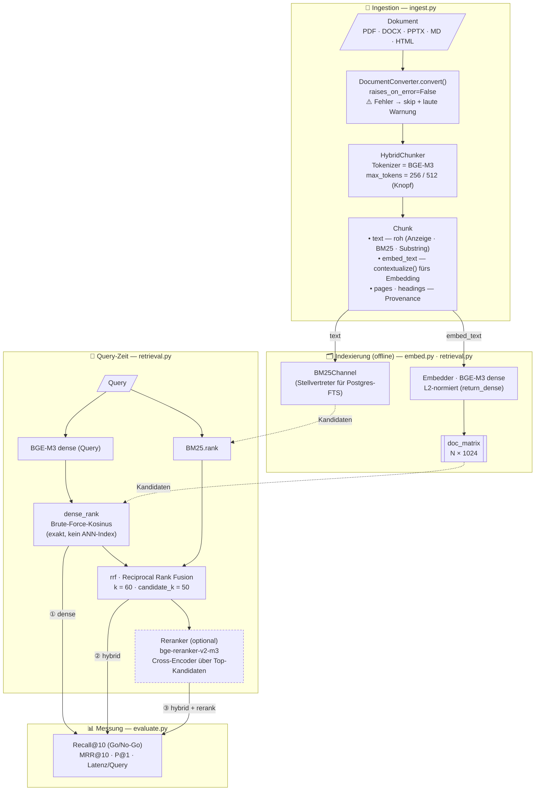

# Pipeline (Phase 1) — Visualisierung

Bildet ab, was der Code unter `experiments/document-indexing/` heute tatsächlich tut.
Rendert direkt in GitHub und in VS Code (Mermaid-Preview).

## Legende

- **Drei evaluierte Konfigurationen** laufen durch dieselbe Pipeline und werden gegeneinander
  gemessen: **① dense** (nur Bedeutungs-Kanal) · **② hybrid** (dense + Wort-Kanal via RRF) ·
  **③ hybrid + rerank** (zusätzlich Cross-Encoder). Der Reranker ist **optional** (gestrichelt).
- **Zwei Texte pro Chunk:** eingebettet wird `contextualize()` (Heading-angereichert), im Index
  für BM25 / Anzeige / Substring-Match liegt der **Rohtext** — bewusst getrennt.
- **BM25** ist hier ein **in-process-Stellvertreter** für das spätere **Postgres-FTS** (Phase 2).
  Für die reine Qualitäts-Validierung ist die exakte FTS-Implementierung ein Detail.
- **Brute-Force-Kosinus, kein ANN:** korrekt für den kleinen, pro-AI-System gefilterten
  Suchraum — und im Spike methodisch nötig (ANN würde die Qualitätsmessung verfälschen).
- Detaillierter Kontext, offene Punkte und Phase 2: siehe [`../../document-indexing-plan.md`](../../document-indexing-plan.md).
